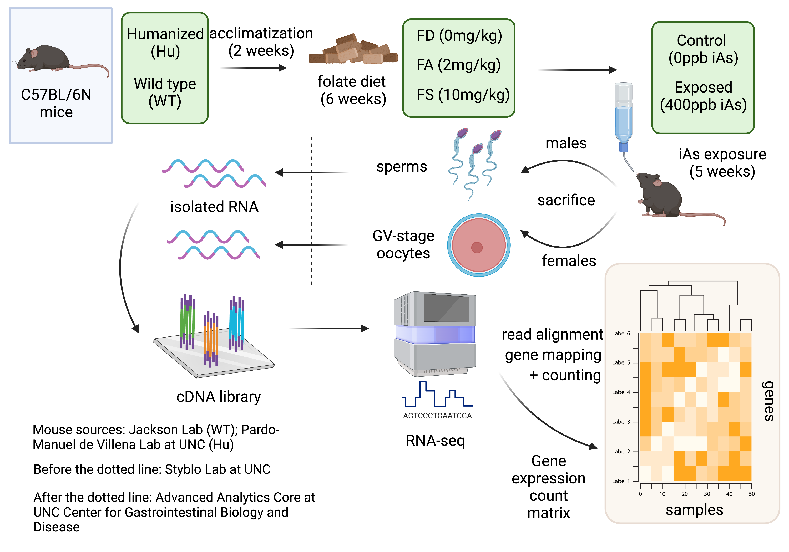

# Analysis Of Gene Expression Data From Germ Cells Of C57BL/6N Inbred Mice With Humanized *As3mt/Borc57* Locus Exposed To Inorganic Arsenic In Drinking Water Under Various Folate Diets

This repository contains code and relevant files concerning my Master's paper project for fulfilling the graduation requirements of M.S. in Biostatistics at UNC-Chapel Hill.

## Abstract
Exposures to inorganic arsenic, a toxic metalloid found naturally in drinking water is a public health concern. In human, metabolism of inorganic arsenic is regularly seen as a detoxification pathway. Dietary intakes of folate, a B-vitamin that is present in many types of food and recommended to be taken daily for all adults and especially pregnant women, is found to interfere with the metabolic outcomes of this pathway. Understanding the genetic pattern shifts underlying elevated folate and arsenic exposures is an important task. Humanized mouse is a model organism that has been widely used to study the role of folate in inorganic arsenic metabolism in human. In this study, we use gene expression read counts from RNA materials in germ cell tissues of humanzed and wildtype C57BL/6N mice to investigate pattern shifts of gene expression in mice under different levels of dietary folate intakes and exposed to different levels of inorganic arsenic in drinking water. We found several differentially expressed genes and enriched gene sets in sperm and oocyte samples following the elevation of dietary folate at a fixed level of arsenic and across the increase of both folate and arsenic. A few gene sets whose annotated functions are related to epithelial to mesenchymal transition, responses to ultraviolet light, and early responses to estrogen appear to be consistently enriched in several comparisons. However, the discovered genes and gene sets do not advance any particular conjecture in biological functions, for which more investigations are needed.

## Acknowledgments
I gratefully acknowledge the generous guidance of Dr. Bahjat Qaqish and Dr. Baiming Zou. Their knowledge on applied statistical research has been particularly helpful in the completion of this paper. My gratitude also goes to Dr. Fei Zou and Dr. Miroslav Styblo for conceptualizing the project and several helpful discussions; to members of the Styblo lab: Bingzhen Shang, Madison Miller, and Christelle Douillet, for their time in walking me through the maze of mouse handling and tissue collection, and pointing me to references for the background of arsenic exposures from drinking water as a public health concern and research interest; to the Advanced Analytics Core at the Center for Gastrointestinal Biology And Disease at UNC for their processing of the collected tissue samples and RNA sequencing (supported by grant P30 DK034987); and to Dr. Fernando Pardo Manuel de Villena and his lab for humanized C57BL/6N mice used in the study. I also want to acknowledge the support of NIEHS grant 1R01ES029925-01 for my research and study at UNC.

## Access
The paper is deposited to [Carolina Digital Repository](https://cdr.lib.unc.edu) on May 1, 2023, but the access level is set to "private" per department rules. To access the paper, please contact the author at tianyi96@live.unc.edu.
